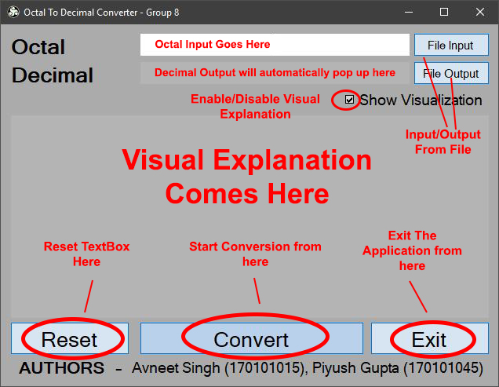
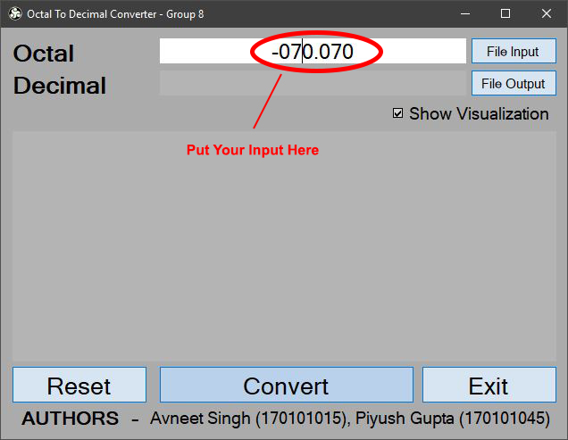
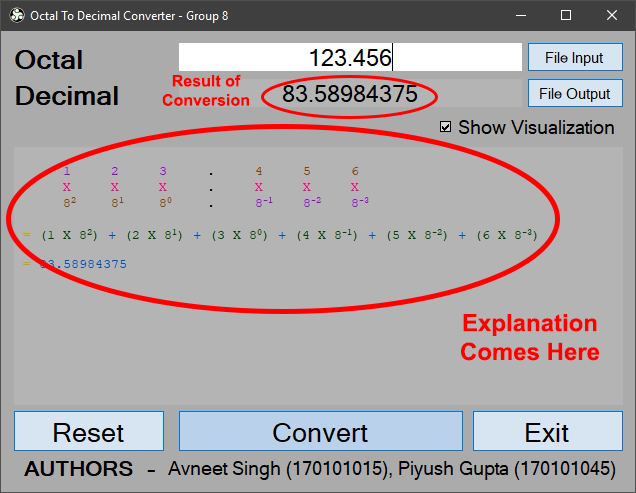
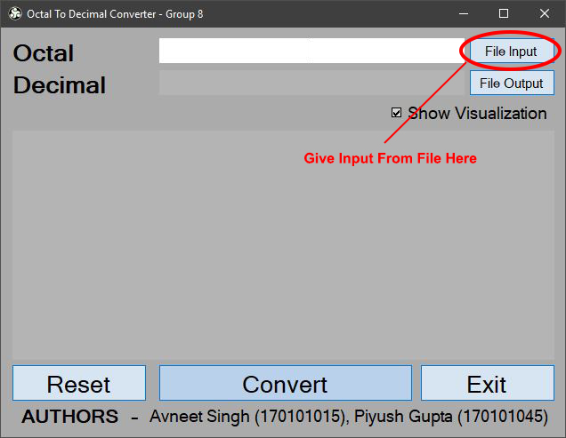
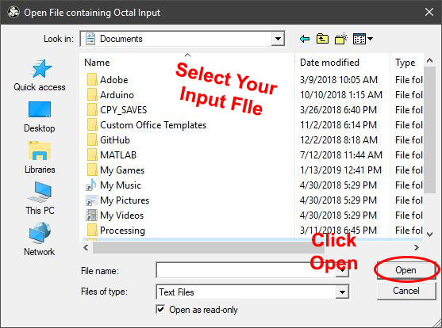
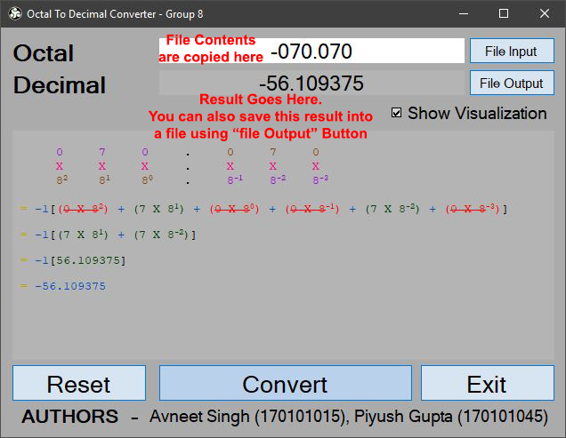
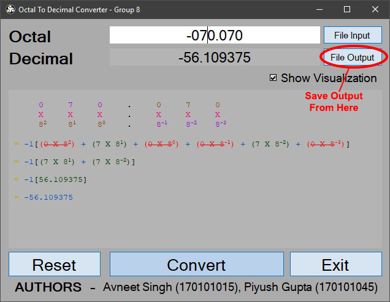
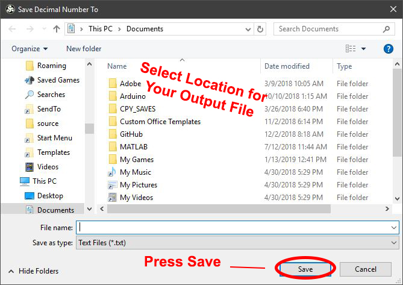

# Octal To Decimal Converter User Docs

All the controls are mentioned in the picture below.

To provide input, user can use both textbox as well as file input. **File Contents are trimmed from both sides**, but still the number needs to be in correct syntax or you will be presented with an error.

Numbers can be positive/negative as well as with fractional parts.

After you have input your number, click on convert or just press Enter to start conversion.

To provide input from file, just click on "File Input" button and select your file.

Content of your file will be loaded into Input TextBox and Other textbox will show you the result.

Similarly, you can also save result into a text file. Just click "File Output" button , select location of storage, provide a name for the file and click save

